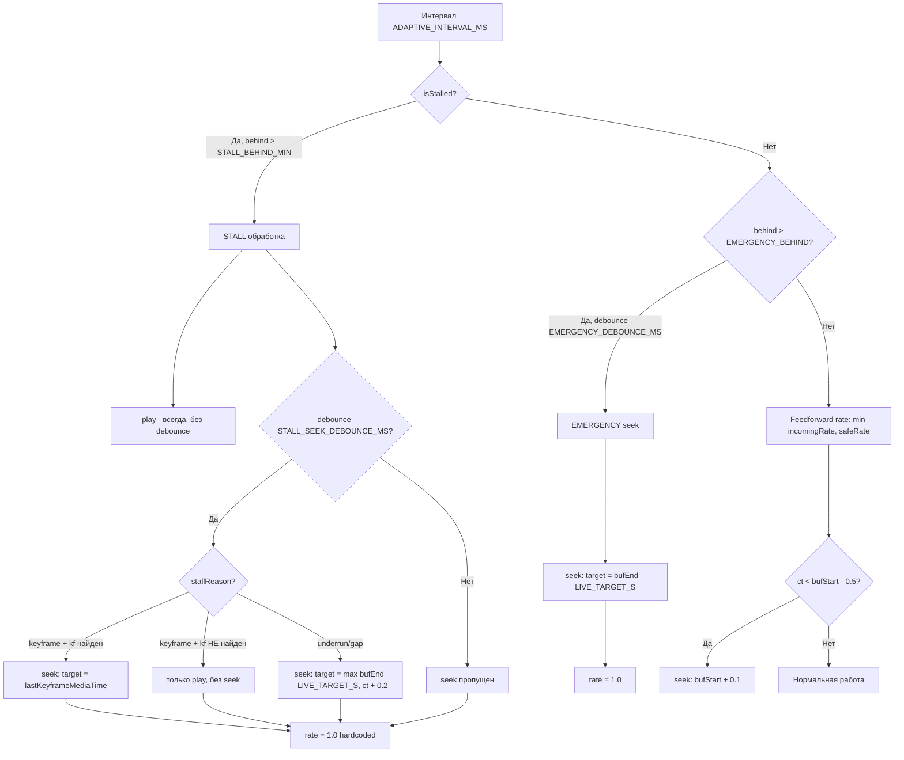

# Адаптивное воспроизведение: недопущение прерываний и минимизация лага

## Константы

Все константы выражены через `LIVE_TARGET_MS` (целевой лаг = 500мс) — точку равновесия, где `playbackRate = 1.0`.

| Константа | Формула | Значение | Описание |
|-----------|---------|----------|----------|
| `LIVE_TARGET_MS` | — | 500 | Целевой лаг в мс — точка равновесия rate=1.0 |
| `LIVE_TARGET_S` | `LIVE_TARGET_MS / 1000` | 0.5 | Целевой лаг в секундах |
| `MIN_RATE` | — | 0.85 | Минимальный playbackRate (15% замедление, net growth 0.15с/с) |
| `MAX_RATE` | — | 1.25 | Максимальный playbackRate (25% ускорение, net drain 0.25с/с) |
| `INCOMING_RATE_WINDOW_MS` | — | 1000 | Окно измерения incomingRate (wall time, мс) |
| `STALL_BEHIND_MIN` | `LIVE_TARGET_S + 0.2` | 0.7 | Минимальное отставание для stall-обработки |
| `EMERGENCY_BEHIND` | `LIVE_TARGET_S × 16 + 0.2` | 8.2 | Порог emergency seek |
| `STALL_SEEK_DEBOUNCE_MS` | — | 500 | Минимальный интервал между stall seek |
| `EMERGENCY_DEBOUNCE_MS` | — | 3000 | Минимальный интервал между emergency seek |
| `ADAPTIVE_INTERVAL_MS` | — | 100 | Интервал поллинга адаптивного контроля |
| `ADAPTIVE_INTERVAL_S` | `ADAPTIVE_INTERVAL_MS / 1000` | 0.1 | Интервал в секундах |
| `KEYFRAME_SIZE_RATIO` | — | 1.5 | Порог keyframe detection: blob > 1.5× avg = keyframe (VP8 keyframes в 5-10× больше P-frames; при низком разрешении ~1.8×) |
| `MIN_KEYFRAME_INTERVAL_S` | `10 / TARGET_FPS` | 1.0 | Минимальный интервал между keyframe'ами (VP8: каждые ~16-20 кадров) |

## Feedforward rate control

### Timestamp протокол

Отправитель добавляет 8 байт `Date.now()` (Float64 little-endian) перед каждым блобом:
```
[8 bytes Float64: Date.now()][blob data]
```

Go relay не парсит — просто ретранслирует.

### incomingRate — скользящее окно по wall-time

Приёмник парсит timestamp из первых 8 байт. Блобы с `sendTime ≤ prevSendTime` пропускаются (не-по-порядку). Скользящее окно по wall-time (1 секунда):

```javascript
if (sendTime > prevSendTime) {
    prevSendTime = sendTime;
    var now = performance.now();
    incomingRateWindow.push({wall: now, st: sendTime});
    while (incomingRateWindow.length > 1 && now - incomingRateWindow[0].wall > INCOMING_RATE_WINDOW_MS) {
        incomingRateWindow.shift();
    }
    if (incomingRateWindow.length >= 2) {
        var mediaSpan = last.st - first.st;   // ms отправителя
        var wallSpan = last.wall - first.wall; // ms наше wall time
        incomingRate = mediaSpan / wallSpan;
    }
}
```

| Сценарий | mediaSpan | wallSpan | incomingRate |
|----------|-----------|----------|--------------|
| Норма | 1000мс | 1000мс | 1.000 |
| Jitter | 1000мс | 1111мс | 0.900 |
| TCP burst | 1000мс | 909мс | 1.100 |

Все блобы ВСЕГДА добавляются в MSE (сохраняют keyframes). Не-по-порядку (sendTime ≤ prevSendTime) пропускаются только для incomingRate.

### safeRate — пропорциональный контроллер

```javascript
safeRate = bufAhead / LIVE_TARGET_S
```

Пропорциональный контроллер: при `bufAhead = LIVE_TARGET_S` → `rate = 1.0` (равновесие), при уменьшении буфера — плавное замедление до `MIN_RATE`.

| bufAhead | safeRate | rate (clamped) | Эффект |
|----------|----------|----------------|--------|
| 1.0с | 2.0 | 1.25 (MAX) | Догоняем, net drain 0.25с/с |
| 0.75с | 1.5 | 1.25 (MAX) | Догоняем |
| 0.5с | 1.0 | 1.0 | Равновесие |
| 0.43с | 0.85 | 0.85 (MIN) | Копим буфер |
| 0.3с | 0.6 | 0.85 (MIN) | Копим, net growth 0.15с/с |

### Feedforward rate (секция 3)

```javascript
rate = clamp(min(incomingRate, safeRate), MIN_RATE, MAX_RATE)
```

| Сценарий | incomingRate | bufAhead | safeRate | rate |
|----------|-------------|----------|----------|------|
| Норма | 1.0 | 0.5 | 1.0 | 1.0 |
| Jitter | 0.9 | 0.3 | 0.6 | 0.85 (MIN) |
| TCP burst | 1.1 | 0.8 | 1.5 | 1.1 |
| У края | 1.1 | 0.25 | 0.5 | 0.85 (MIN) |

## Определение stall

```javascript
ctDelta = ct - lastCt;
isStalled = readyState < 3 || (lastCt > 0 && ctDelta < playbackRate × ADAPTIVE_INTERVAL_S × 0.5);
```

Два критерия:
1. **readyState < 3** — браузер сообщает о нехватке данных
2. **ctDelta < playbackRate × 0.05** — currentTime не сдвигается с учётом playbackRate за интервал 100мс

При `playbackRate = 1.0`: порог = 0.05с за 100мс
При `playbackRate = 1.5`: порог = 0.075с за 100мс

## Поток принятия решений



## Три уровня обработки

### 1. STALL обработка — видео зависло

**Условие:** `isStalled && behind > STALL_BEHIND_MIN` (0.7с)

**Диагноз stallReason:**
- `rs < 3 && bufAhead > LIVE_TARGET_S` → `keyframe` — данные есть, но декодер ждёт I-frame
- `rs < 3 && bufAhead ≤ LIVE_TARGET_S` → `underrun` — данных нет
- `rs ≥ 3 && ranges > 1` → `gap` — ct в обрыве буфера
- `rs ≥ 3 && ranges = 1` → `keyframe` — ct не двигается при наличии данных

**Действия без debounce** — выполняются каждый интервал:
- `play()` — попытка возобновить воспроизведение
- `playbackRate = 1.0` — hardcoded, без ускорения после stall

**Действия с debounce** `STALL_SEEK_DEBOUNCE_MS` (500мс) — две стратегии:

| stallReason | lastKeyframeMediaTime | Действие |
|-------------|----------------------|----------|
| `keyframe` | `>= bufStart && >= ct` (в буфере и не позади ct) | `currentTime = lastKeyframeMediaTime - TARGET_FPS/200` — seek между кадрами, браузер найдёт ближайший keyframe |
| `keyframe` | `< bufStart` или `< ct` (вне буфера или позади ct) | `currentTime = max(bufEnd - LIVE_TARGET_S * 2, ct + 0.2)` — точка равновесия (1с от края) |
| `underrun`/`gap` | — | `currentTime = max(bufEnd - LIVE_TARGET_S * 2, ct + 0.2)` — seek в точку равновесия (1с от края) |

**Почему `kf >= ct`, а не `kf > ct`:**
После stall seek на `kf - 0.05`, ct ≈ kf, и строгое `kf > ct` ложно → emergency seek прыгает на equilibrium вместо keyframe, пропуская секунды видео. Условие `kf >= ct` разрешает seek к keyframe даже когда ct ≈ kf.

**Почему keyframe позади ct — fall through:**
Если `lastKeyframeMediaTime < ct` (keyframe позади), seek к нему бессмысленен — видео уже прошло этот keyframe. В этом случае fall through к точке равновесия. Лог содержит `kf_age` (ct - lastKeyframeMediaTime) для диагностики устаревших keyframe.

**Почему seek на `kf - 0.05` (между кадрами):**
Seek точно на keyframe может попасть на предыдущий кадр из-за погрешности `pendingKeyframeMediaTime`. Смещение -0.05 (полкадра при 10fps) ставит ct между кадрами — браузер найдёт ближайший keyframe и начнёт декодирование с него.

**Почему seek к keyframe (даже назад):**
При [keyframe] stall декодер ждёт I-frame. Обычный seek в `bufEnd - LIVE_TARGET_S` может попасть на P-frame — stall продолжится. Seek к `lastKeyframeMediaTime` гарантирует начало с I-frame. Keyframes каждые ~1.6-2с, поэтому seek назад максимум на 2с лучше, чем stall на 3+ секунд.

**Почему rate = 1.0 после stall:**
Ускорение после stall вызывает потерю keyframe — декодер не успевает обработать I-frame при rate > 1.0. После stall seek мы уже у точки равновесия (`behind_new ≈ LIVE_TARGET_S`), поэтому догонять не нужно. Feedforward (секция 3) подхватит нормальную скорость на следующем тике.

### 2. EMERGENCY seek — большое отставание

**Условие:** `behind > EMERGENCY_BEHIND` (≈8.2с) `&& !isStalled && debounce 3с`

**Действия:**
- Keyframe в буфере и не позади ct (`lastKeyframeMediaTime >= bufStart && >= ct`): `currentTime = lastKeyframeMediaTime - TARGET_FPS/200` — seek между кадрами (чистый старт декодирования)
- Keyframe вне буфера или позади ct: `currentTime = bufEnd - LIVE_TARGET_S * 2` — прыжок в точку равновесия (1с от края)
- `playbackRate = 1.0` — мы у точки равновесия / keyframe

### 3. Feedforward rate — нормальная работа

**Условие:** `!isStalled && firstAppendDone`

**Действие:** `playbackRate = clamp(min(incomingRate, safeRate), MIN_RATE, MAX_RATE)`

- `incomingRate` — скорость входящего потока (из sliding window по timestamp блобов)
- `safeRate = bufAhead / ADAPTIVE_INTERVAL_S` — максимальный rate без исчерпания буфера
- `MIN_RATE = 0.85` — не замедляемся слишком сильно
- `MAX_RATE = 1.25` — ускоряемся до 1.5x для догоняния при TCP burst

## 4. Gap detection — прыжок через обрывы буфера

В режиме `segments` MSE может создавать разрывы (gaps) между buffered ranges. Gap detection прыгает через них до того, как они вызовут stall.

### Предиктивный прыжок

**Условие:** ct в range, `timeToReachEnd ≤ ADAPTIVE_INTERVAL_S` (≈100мс до конца range), есть следующий range с gap > 0

**Действие:**
- `currentTime = nextStart + 0.01` — прыжок к началу следующего range
- `play()` — возобновление воспроизведения
- Лог: `GAP PREDICTIVE ct=X -> Y gap=Zs`

### В-яме (ct оказался в gap)

**Условие:** ct < gStart и ct > предыдущего range end (или gi === 0)

**Действие:**
- `currentTime = gStart + 0.01` — прыжок к началу ближайшего range
- `play()` — возобновление воспроизведения
- Лог: `GAP IN-HOLE ct=X -> Y gap=Zs`

### Защита от конфликтов seek

Переменная `didSeekInTick` предотвращает конфликты между seek-ами в одном тике интервала.

## 5. Keyframe detection по размеру блоба

Keyframe (I-frame) блобы значительно больше обычных P-frame блобов (5-10× для VP8). VP8 генерирует keyframes каждые ~16-20 кадров (~1.6-2с при 10fps). Это позволяет детектировать keyframes по размеру без парсинга видеопотока.

**Проблема ложных срабатываний:** при высоком разрешении P-frames имеют вариацию размеров до 2× из-за движения. Порог 1.5× вызывал каскад ложных срабатываний: крупный P-frame → «keyframe» → исключается из EMA → avgBlobSize не растёт → следующий крупный P-frame тоже > 1.5× → каскад. Решение: порог 1.5× + минимальный интервал 10 кадров (`MIN_KEYFRAME_INTERVAL_S`). При низком разрешении (364×272) VP8 keyframes ~1.8× от среднего — порог 2.0× их пропускал. MIN_KEYFRAME_INTERVAL_S блокирует каскад даже при пороге 1.5×.

### Переменные

| Переменная | Описание |
|------------|----------|
| `KEYFRAME_SIZE_RATIO` | 1.5 — порог: blob > 1.5× avg = keyframe (VP8 keyframes в 5-10× больше P-frames; при низком разрешении ~1.8×) |
| `MIN_KEYFRAME_INTERVAL_S` | `10 / TARGET_FPS` — минимум 10 кадров между keyframe'ами (VP8: каждые ~16-20 кадров) |
| `avgBlobSize` | EMA размера обычных блобов (без keyframe) |
| `pendingKeyframeMediaTime` | bufEnd до append keyframe блоба (→ media time после append) |
| `lastKeyframeMediaTime` | Подтверждённый media time последнего keyframe |

### Детектирование в processMSEQueue

```javascript
// Пропускаем мелкие блобы (<500 байт) — init segment, не видеоданные
// Минимальный интервал: VP8 keyframes каждые ~16-20 кадров, ближе 10 кадров = ложное срабатывание
if (chunkSize > 500 && avgBlobSize > 500 && chunkSize > avgBlobSize * KEYFRAME_SIZE_RATIO) {
    if (remoteVideo.buffered.length > 0) {
        var bufEnd = remoteVideo.buffered.end(remoteVideo.buffered.length - 1);
        var lastKnownKf = Math.max(lastKeyframeMediaTime, pendingKeyframeMediaTime);
        var timeSinceLastKf = lastKnownKf < 0 ? Infinity : (bufEnd - lastKnownKf);
        if (timeSinceLastKf >= MIN_KEYFRAME_INTERVAL_S) {
            pendingKeyframeMediaTime = bufEnd;
        }
        // else: ложное срабатывание — слишком скоро после предыдущего keyframe, игнорируем
    }
} else if (chunkSize > 500) {
    avgBlobSize = avgBlobSize === 0 ? chunkSize : avgBlobSize * 0.9 + chunkSize * 0.1;
}
```

**Ключевые моменты:**
- Фильтр `chunkSize > 500` исключает init segment (1 байт) из EMA и keyframe detection
- Фильтр `avgBlobSize > 500` гарантирует, что EMA накопил реальные размеры
- Проверка `buffered.length > 0` — первый append не создаёт buffered range
- EMA обновляется только обычными блобами — keyframe исключаются
- **Интервал `MIN_KEYFRAME_INTERVAL_S`**: блокирует каскад ложных срабатываний — после первого (возможно ложного) keyframe следующие 10 кадров игнорируются
- **Порог `KEYFRAME_SIZE_RATIO = 1.5`**: отсекает большинство P-frames; при низком разрешении VP8 keyframes ~1.8× от среднего. MIN_KEYFRAME_INTERVAL_S блокирует каскад ложных срабатываний

### Подтверждение в onMSEUpdateEnd

```javascript
if (pendingKeyframeMediaTime >= 0) {
    lastKeyframeMediaTime = pendingKeyframeMediaTime;
    diagLog('KEYFRAME CONFIRMED mediaTime=' + lastKeyframeMediaTime);
    pendingKeyframeMediaTime = -1;
}
```

### Использование в stall handler

См. секцию 1 (STALL обработка) — две стратегии:
- `[keyframe]` + `lastKeyframeMediaTime >= bufStart` → seek к keyframe (вперёд или назад)
- Всё остальное → seek в точку равновесия `max(bufEnd - LIVE_TARGET_S, ct + 0.2)`

### Защита в trimBuffer

`trimBuffer` не обрезает последний известный keyframe:

```javascript
if (lastKeyframeMediaTime >= bufferStart && lastKeyframeMediaTime < removeEnd) {
    removeEnd = lastKeyframeMediaTime;
}
```

Это гарантирует, что `lastKeyframeMediaTime` всегда доступен для stall recovery, даже если он на ~2с позади `bufEnd`.

### Сброс при MSE restart

```javascript
avgBlobSize = 0;
pendingKeyframeMediaTime = -1;
lastKeyframeMediaTime = -1;
```

## Защита от граничных случаев

| Случай | Обработка |
|--------|-----------|
| `behind ≈ LIVE_TARGET_S` → `target ≈ ct` | `max(bufEnd - LIVE_TARGET_S, ct + 0.2)` гарантирует движение на 0.2с |
| `readyState ≥ 3`, но ct не двигается | ct-based stall detection: `ctDelta < playbackRate × 0.05` |
| MSE restart | Сброс `incomingRateWindow`, `prevSendTime`, `incomingRate`, `lastCt`, `avgBlobSize`, `pendingKeyframeMediaTime`, `lastKeyframeMediaTime` |
| `ct < bufStart - 0.5` | Seek к `bufStart + 0.1` + `play()` |
| Видео на паузе при `firstAppendDone` | Безусловный `play()` каждый интервал |
| Gap в буфере перед stall | Предиктивный прыжок через gap при `timeToReachEnd ≤ ADAPTIVE_INTERVAL_S` |
| ct провалился в gap | Прыжок к началу следующего range + `play()` |
| Несколько seek в одном тике | `didSeekInTick` — gap detection пропускается если уже был seek |
| Не-по-порядку блоб (sendTime ≤ prevSendTime) | Добавляется в MSE, но не учитывается для incomingRate |
| Keyframe stall без известного keyframe | Только `play()`, без seek — избегаем seek на P-frame |