# План: Передача соотношения сторон окна MSE пиру

## Проблема

Когда пир запрашивает видео с ограничением по mpx, отправитель подбирает разрешение камеры,
опираясь на **аспект самой камеры** (`caps.maxW / caps.maxH`) или в фолбэке — на **своё окно**
(`window.innerWidth / window.innerHeight`). Но видео отображается в окне **пира**, поэтому
камера может выдать разрешение с неправильным соотношением сторон — например, 16:9 вместо 4:3,
и на экране пира видео будет с чёрными полосами или обрезано.

Дополнительные проблемы:
- `init()` — хардкод `H = W * 3/4` (всегда 4:3), игнорирует аспект камеры
- `init()` — `savedPeerW/H` — это разрешение видео пира; портретное видео пира → наша камера тоже портретная
- `init()` — upgrade-блок ограничивает камеру до 1280×720 вместо ограничения по mpx
- `camBtn` — та же проблема с `savedPeerW/H`
- `findBestResolution()` — `pixelsAt()` при clamp может инвертировать аспект
- `applyDesiredResolution()` — нет `aspectRatio` constraint, мобильные камеры игнорируют аспект

## Выполненные изменения (8 пунктов)

### 1. Глобальные переменные peerDisplayW/peerDisplayH
**Файл:** videocall.html, строка 553-554

Добавлены переменные для хранения размеров MSE-окна пира:
```javascript
var peerDisplayW = 0; // ширина MSE-окна пира (для аспект-соотношения)
var peerDisplayH = 0; // высота MSE-окна пира (для аспект-соотношения)
```

### 2. sendSettings() — отправка displayW/displayH
**Файл:** videocall.html, строки 449-479

Измеряется `.video-container.main-video` и отправляется пиру:
```javascript
var mainContainer = document.querySelector('.video-container.main-video');
var dw = mainContainer ? mainContainer.clientWidth : 0;
var dh = mainContainer ? mainContainer.clientHeight : 0;
// ... в JSON добавлено:
displayW: dw,
displayH: dh
```

### 3. handlePeerSettings() — извлечение displayW/displayH
**Файл:** videocall.html, строки 1376-1389

Извлекает размеры окна пира, детектит изменение:
```javascript
var newPeerDisplayW = 0, newPeerDisplayH = 0;
if (msg.displayW > 0) newPeerDisplayW = Math.round(msg.displayW);
if (msg.displayH > 0) newPeerDisplayH = Math.round(msg.displayH);
var displayChanged = false;
if (newPeerDisplayW > 0 && newPeerDisplayH > 0) {
    if (peerDisplayW !== newPeerDisplayW || peerDisplayH !== newPeerDisplayH) {
        displayChanged = true;
    }
    peerDisplayW = newPeerDisplayW;
    peerDisplayH = newPeerDisplayH;
}
```

### 4. findBestResolution() — аспект пира
**Файл:** videocall.html, строки 1296-1357

Сигнатура изменена: `findBestResolution(mpx)` → `findBestResolution(mpx, dispW, dispH)`

В пути с camera capabilities аспект пира приоритетнее аспекта камеры:
```javascript
var aspect;
if (dispW > 0 && dispH > 0) {
    aspect = dispW / dispH;
} else {
    aspect = caps.maxW / caps.maxH;
}
```

В фолбэке — цепочка: аспект пира → аспект камеры → хардкод 4:3
(`window.innerWidth`/`window.innerHeight` не используется — это размер браузерного окна, не связанный ни с камерой, ни с пиром):
```javascript
if (dispW > 0 && dispH > 0) {
    aspectW = dispW;
    aspectH = dispH;
} else if (s.width > 0 && s.height > 0) {
    aspectW = s.width;
    aspectH = s.height;
} else {
    aspectW = 4;
    aspectH = 3;
}
```

### 5. Вызов findBestResolution() в handlePeerSettings()
**Файл:** videocall.html, строка 1408

Передаются размеры пира:
```javascript
var best = findBestResolution(msg.mpx, peerDisplayW, peerDisplayH);
```

### 6. displayChanged в условии рестарта рекордера
**Файл:** videocall.html, строка 1517

```javascript
} else if (codecChanged || resolutionChanged || compositionChanged || wasStopped || displayChanged) {
```

### 7. ResizeObserver на MSE-контейнере
**Файл:** videocall.html, строки 739-750

При ресайзе окна переотправляются settings пиру с debounce 500мс:
```javascript
var resizeDebounceTimer = null;
var mainVideoContainer = document.querySelector('.video-container.main-video');
if (mainVideoContainer && typeof ResizeObserver !== 'undefined') {
    new ResizeObserver(function() {
        if (resizeDebounceTimer) clearTimeout(resizeDebounceTimer);
        resizeDebounceTimer = setTimeout(function() {
            sendSettings();
        }, 500);
    }).observe(mainVideoContainer);
}
```

## Оставшиеся изменения (4 пункта)

### 8. init() — двухфазный запуск камеры
**Место:** videocall.html, строки 1094-1156

**Проблема:**
- `W = Math.min(Math.floor(window.innerWidth * 0.8), 1280)` — хардкод
- `H = Math.min(Math.floor(W * 3 / 4), 720)` — всегда 4:3
- `savedPeerW/H` из localStorage — разрешение видео прошлого пира, не контейнер
- Upgrade-блок с `Math.min(maxW, 1280)` — избыточное ограничение

**Решение:** Двухфазный подход:
1. Фаза 1: `applyMpx(S.mpx, 4, 3)` → `getUserMedia()` с фолбэк-аспектом 4:3
2. Фаза 2: `getCameraCapabilities()` → нативный аспект → `applyConstraints()` с mpx + аспект

Убираются: `savedPeerW/H`, хардкод 1280×720, весь upgrade-блок.

```javascript
// Фаза 1: getUserMedia с фолбэк-аспектом 4:3
var initR = applyMpx(4, 3, S.mpx);
var W = initR.w;
var H = initR.h;

localStream = await navigator.mediaDevices.getUserMedia({
    video: addFrameRateConstraint({ width: { ideal: W }, height: { ideal: H }, facingMode: 'user' }),
    audio: {
        echoCancellation: S.ec,
        noiseSuppression: S.ns,
        autoGainControl: S.agc
    }
});
localVideo.srcObject = localStream;

// Фаза 2: уточняем разрешение по нативному аспекту камеры + mpx
var camCaps = getCameraCapabilities();
var vtInit = localStream.getVideoTracks()[0];
if (vtInit) {
    var vsInit = vtInit.getSettings();
    diagLog('CAM init settings: ' + vsInit.width + 'x' + vsInit.height + ' fps=' + (vsInit.frameRate || 'n/a'));

    // Определяем нативный аспект камеры
    var initAspect = 4 / 3;
    if (camCaps && camCaps.maxW > 0 && camCaps.maxH > 0) {
        initAspect = camCaps.maxW / camCaps.maxH;
        diagLog('CAM caps: ' + camCaps.minW + '-' + camCaps.maxW + 'x' + camCaps.minH + '-' + camCaps.maxH + ' step=' + camCaps.stepW + 'x' + camCaps.stepH + ' aspect=' + initAspect.toFixed(2));
    } else if (vsInit.width && vsInit.height) {
        initAspect = vsInit.width / vsInit.height;
        diagLog('CAM caps: NOT AVAILABLE, using settings aspect=' + initAspect.toFixed(2));
    } else {
        diagLog('CAM caps: NOT AVAILABLE, using fallback aspect=' + initAspect.toFixed(2));
    }

    // Пересчитываем разрешение по нативному аспекту + mpx
    var initR2 = applyMpx(initAspect > 1 ? initAspect : 1/initAspect, initAspect > 1 ? 1 : initAspect, S.mpx);
    W = initR2.w;
    H = initR2.h;

    // Применяем уточнённое разрешение
    try {
        await vtInit.applyConstraints(addFrameRateConstraint({ width: { ideal: W }, height: { ideal: H }, aspectRatio: { ideal: initAspect } }));
        vsInit = vtInit.getSettings();
        diagLog('CAM init aspect=' + initAspect.toFixed(2) + ' res=' + vsInit.width + 'x' + vsInit.height);
    } catch(e) { diagLog('CAM aspect apply failed: ' + e.message); }

    if (typeof vtInit.getCapabilities === 'function') {
        try {
            var fullCaps = vtInit.getCapabilities();
            diagLog('CAM full capabilities: ' + JSON.stringify(fullCaps));
        } catch(e) { diagLog('CAM getCapabilities error: ' + e.message); }
    }
}
```

### 9. camBtn — аспект контейнера пира + mpx
**Место:** videocall.html, строки 820-823

**Проблема:** Использует `savedPeerW/H` из localStorage — разрешение видео прошлого пира.

**Решение:** Использовать `peerDisplayW/H` (реальный контейнер текущего пира) + mpx:

```javascript
// Аспект: приоритет — контейнер пира, фолбэк — камера
var camAspect = 4 / 3;
var camCaps = getCameraCapabilities();
if (camCaps) camAspect = camCaps.maxW / camCaps.maxH;
if (peerDisplayW > 0 && peerDisplayH > 0) {
    camAspect = peerDisplayW / peerDisplayH;
}
var camR = applyMpx(camAspect >= 1 ? camAspect : 1, camAspect >= 1 ? 1 : camAspect, S.mpx);
var camW = camR.w;
var camH = camR.h;
var newStream = await navigator.mediaDevices.getUserMedia({
    video: addFrameRateConstraint({ width: { ideal: camW }, height: { ideal: camH }, aspectRatio: { ideal: camAspect }, facingMode: 'user' }),
    audio: false
});
```

### 10. findBestResolution() — защита от инверсии аспекта при clamp
**Место:** videocall.html, после строки 1342 (после проверки чётности)

**Проблема:** При clamp к `caps.minH/maxH` бинарный поиск может дать портретный результат
для ландшафтного запроса (или наоборот).

**Решение:** Проверка и инверсия при необходимости:

```javascript
// Защита от инверсии аспекта при clamp
if (aspect > 1 && bestW <= bestH) {
    // Ландшафтный запрос дал портретный результат — инвертировать
    var tmp = bestW; bestW = bestH; bestH = tmp;
    if (bestW % 2 !== 0) bestW = Math.max(caps.minW, bestW - caps.stepW);
    if (bestH % 2 !== 0) bestH = Math.max(caps.minH, bestH - caps.stepH);
} else if (aspect < 1 && bestH <= bestW) {
    // Портретный запрос дал ландшафтный результат — инвертировать
    var tmp = bestW; bestW = bestH; bestH = tmp;
    if (bestW % 2 !== 0) bestW = Math.max(caps.minW, bestW - caps.stepW);
    if (bestH % 2 !== 0) bestH = Math.max(caps.minH, bestH - caps.stepH);
}
```

### 11. applyDesiredResolution() — aspectRatio constraint
**Место:** videocall.html, строки 1241-1252

**Проблема:** Мобильные камеры могут игнорировать соотношение сторон при
`applyConstraints({width, height})`.

**Решение:** Добавить `aspectRatio: {ideal: dw/dh}`:

```javascript
async function applyDesiredResolution(dw, dh) {
    if (dw <= 0 || dh <= 0) return;
    var videoTracks = localStream.getVideoTracks();
    if (videoTracks.length === 0) return;
    try {
        var constraints = addFrameRateConstraint({ width: { ideal: dw }, height: { ideal: dh } });
        // aspectRatio помогает мобильным камерам понять нужную ориентацию
        if (dw > 0 && dh > 0) {
            constraints.aspectRatio = { ideal: dw / dh };
        }
        await videoTracks[0].applyConstraints(constraints);
```

## Диаграмма потока после всех исправлений

```mermaid
graph TD
    subgraph init
        A[Фаза 1: applyMpx mpx, 4, 3] --> B[getUserMedia]
        B --> C[Фаза 2: getCameraCapabilities]
        C --> D[applyConstraints mpx + нативный аспект]
    end
    subgraph handlePeerSettings
        E[msg.mpx + peerDisplayW/H] --> F[findBestResolution + защита от инверсии]
        F --> G[applyDesiredResolution + aspectRatio]
    end
    subgraph camBtn
        H[peerDisplayW/H + mpx] --> I[getUserMedia + aspectRatio constraint]
    end
    style D fill:#4ecca3,stroke:#fff,color:#fff
    style G fill:#4ecca3,stroke:#fff,color:#fff
    style I fill:#4ecca3,stroke:#fff,color:#fff
```



## Сводка

| # | Статус | Место | Изменение |
|---|--------|-------|-----------|
| 1 | ✅ | строка 553-554 | Глобальные peerDisplayW/peerDisplayH |
| 2 | ✅ | sendSettings() | displayW/displayH из .video-container.main-video |
| 3 | ✅ | handlePeerSettings() | Извлечение displayW/displayH, displayChanged |
| 4 | ✅ | findBestResolution() | Параметр dispW, dispH; аспект пира приоритетнее |
| 5 | ✅ | handlePeerSettings() | Передача peerDisplayW, peerDisplayH в findBestResolution |
| 6 | ✅ | handlePeerSettings() | displayChanged в условии рестарта рекордера |
| 7 | ✅ | после init UI | ResizeObserver на .video-container.main-video |
| 8 | ⬜ | init() стр. 1094-1156 | Двухфазный запуск: фолбэк 4:3 → нативный аспект + mpx |
| 9 | ⬜ | camBtn стр. 820-823 | peerDisplayW/H + mpx + aspectRatio constraint |
| 10 | ⬜ | findBestResolution() стр. 1342 | Защита от инверсии аспекта при clamp |
| 11 | ⬜ | applyDesiredResolution() стр. 1247 | Добавить aspectRatio constraint |
