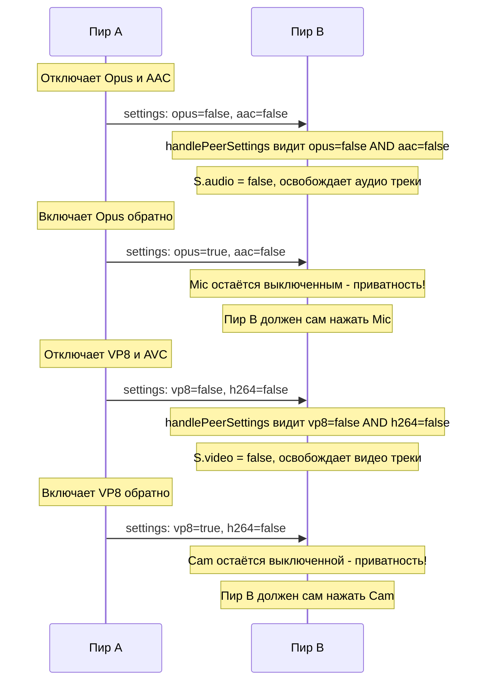

# План: Логика приватности кодеков в videocall.html

## Требование
Когда один участник (Пир A) отключает все аудио кодеки (Opus + AAC) или все видео кодеки (VP8 + AVC), у его собеседника (Пир B) автоматически отключается соответствующее устройство (Mic или Cam).

**Приватность:** Обратное включение кодеков у Пира A НЕ должно автоматически включать Mic/Cam у Пира B. Пир B должен сам нажать свою кнопку Mic/Cam.

## Логика работы



## Изменения в коде

### Единственное изменение: функция handlePeerSettings() - строка ~1806

Вставить блок проверки кодеков пира ПОСЛЕ строки `peerSettings = msg;` (строка 1808) и ПОСЛЕ проверки `if (!isActive || !localStream) return;` (строка 1810), но ДО проверки `if (initial) return;` (строка 1854):

```javascript
// === PRIVACY: если у пира все аудио кодеки выключены — отключаем свой микрофон ===
var peerNoAudio = msg.opus === false && msg.aac === false;
if (peerNoAudio && S.audio) {
    diagLog('PRIVACY: peer disabled all audio codecs, turning off my Mic');
    S.audio = false;
    if (localStream) {
        localStream.getAudioTracks().forEach(function(t) { t.stop(); localStream.removeTrack(t); });
    }
    applySettings(); saveSettings();
    if (!S.audio && !S.video) {
        if (mediaRecorder && mediaRecorder.state !== 'inactive') {
            mediaRecorder.stop(); recorderStarted = false;
        }
    } else if (recorderStarted) {
        restartMediaRecorder('settings');
    }
}

// === PRIVACY: если у пира все видео кодеки выключены — отключаем свою камеру ===
var peerNoVideo = msg.vp8 === false && msg.h264 === false;
if (peerNoVideo && S.video) {
    diagLog('PRIVACY: peer disabled all video codecs, turning off my Cam');
    S.video = false;
    if (localStream) {
        localStream.getVideoTracks().forEach(function(t) { t.stop(); localStream.removeTrack(t); });
    }
    applySettings(); saveSettings();
    if (!S.audio && !S.video) {
        if (mediaRecorder && mediaRecorder.state !== 'inactive') {
            mediaRecorder.stop(); recorderStarted = false;
        }
    } else if (recorderStarted) {
        restartMediaRecorder('settings');
    }
}
```

### Ключевые моменты
- Проверяем `msg.opus === false && msg.aac === false` — строго false, не undefined
- Только ОДНОНАПРАВЛЕННОЕ действие: выключение. Включение кодеков у пира НЕ включает Mic/Cam
- Освобождаем треки (stop + removeTrack) — физически отпускаем устройство
- Обновляем UI через applySettings(), сохраняем через saveSettings()
- Рестарт рекордера при необходимости
