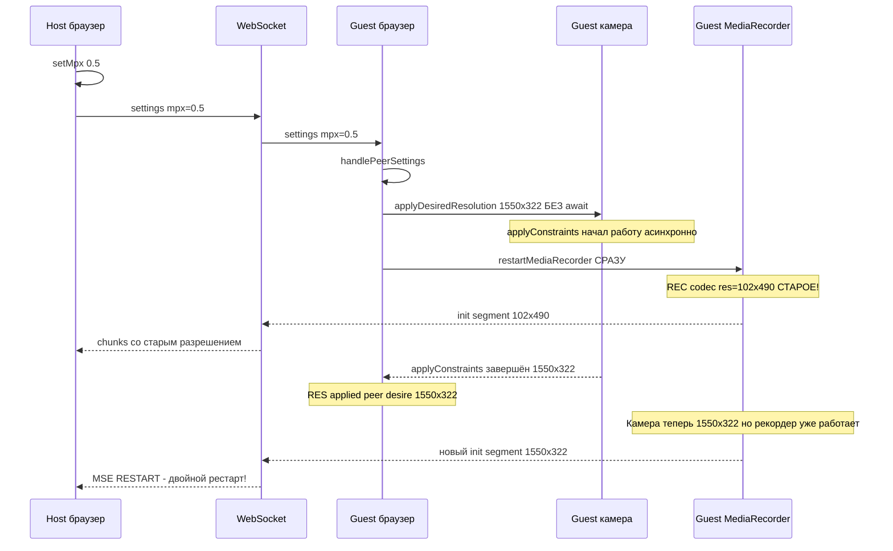
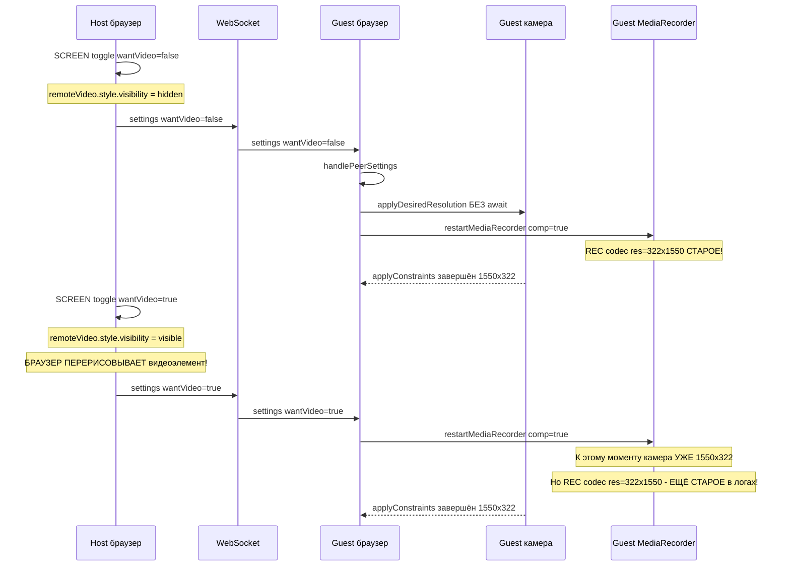
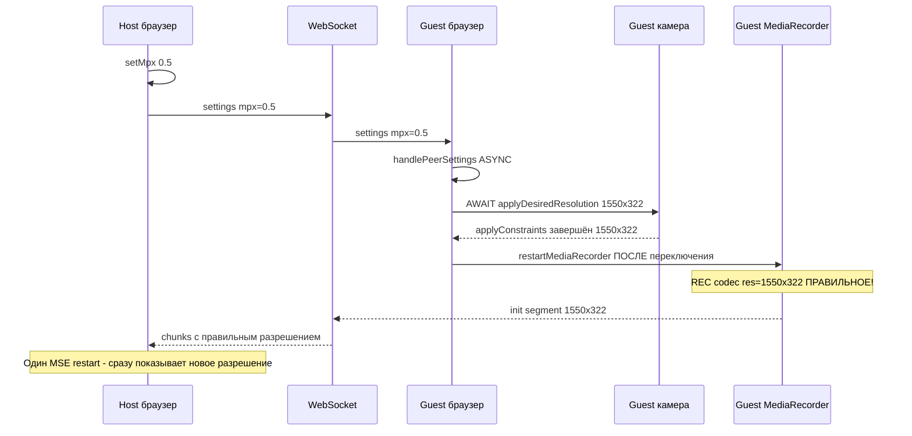

# План исправления задержки разрешения при смене mpx

## Хронология из логов

### SETMPX 0.05→0.5 — что происходит



### SCREEN toggle off→on — что происходит



## Две проблемы из логов

### Проблема 1: Рекордер стартует со старым разрешением

applyDesiredResolution - async с await applyConstraints внутри.
Вызывается БЕЗ await в handlePeerSettings строка ~1467.
Рекордер стартует ДО завершения applyConstraints.

Доказательство из логов - ВСЕГДА REC codec res=СТАРОЕ перед RES applied:

| Сценарий       | REC codec res | RES applied   | Флаг рестарта |
|----------------|---------------|---------------|---------------|
| SETMPX 0.05→0.5 | 102x490      | 1550x322      | res=true      |
| SCREEN off     | 322x1550      | 1550x322      | comp=true     |
| SCREEN on      | 322x1550      | 1550x322      | comp=true     |
| SETMPX 0.5→0.05 | 322x1550    | 490x102       | res=true      |

### Проблема 2: Браузер не перерисовывает видеоэлемент

При SCREEN toggle applySettings меняет remoteVideo.style.visibility:
- wantVideo=false → visibility=hidden
- wantVideo=true → visibility=visible

Это принудительно перерисовывает элемент → новое разрешение видно.

При SETMPX visibility НЕ меняется → браузер не обновляет отображение.

## План исправления

### Шаг 1: Скрыть/показать remoteVideo в setMpx — РЕАЛИЗОВАНО

videocall.html setMpx строка 497:
```javascript
remoteVideo.style.visibility = 'hidden';
setTimeout(function() {
    if (S.wantVideo) remoteVideo.style.visibility = 'visible';
}, 1000);
```

### Шаг 2: await applyDesiredResolution в handlePeerSettings

Чтобы рекордер стартовал с ПРАВИЛЬНЫМ разрешением:

1. Сделать handlePeerSettings async:
```javascript
async function handlePeerSettings(msg, initial) {
```

2. Добавить await перед applyDesiredResolution строка ~1467:
```javascript
await applyDesiredResolution(best.w, best.h);
```

3. Добавить .catch на вызов в WS onmessage строка ~1614:
```javascript
handlePeerSettings(msg, initial).catch(function(e) {
    diagLog('handlePeerSettings error: ' + e.message);
});
```

4. Перенести lastHandledMpx обновление до await чтобы избежать гонок:
```javascript
if (Math.abs(msg.mpx - lastHandledMpx) > 0.001) {
    resolutionChanged = true;
    lastHandledMpx = msg.mpx;  // ← перенести сюда
}
```

### Ожидаемый результат после Шага 2


