# Аналогии между JS MediaRecorder и Go MediaSender

## Обзор архитектуры

Видеозвонок имеет **два режима отправки медиа**:

| Режим | Отправка | Приём | Где работает |
|-------|----------|-------|--------------|
| Browser sender | JS `MediaRecorder` | JS `MediaSource` + MSE | Мобильный `#1`, fallback на десктопе |
| Go sender | Go `mediaRecorder` | JS `MediaSource` + MSE | Десктоп `#2` |

**Ключевое отличие**: на десктопе `#2` камеру захватывает Go-процесс через `mediadevices`, а браузер только отображает и принимает видео. На мобильном `#1` всё делает браузер.

---

## Переменные состояния

| JS (`videocall.html`) | Go (`media_sender.go`) | Описание |
|---|---|---|
| `localStream` | `localStream` | Захваченный поток камеры/микрофона |
| `mediaRecorder` | `mediaRecorderInst` | Экземпляр MediaRecorder |
| `recorderStarted` | `recorderStarted` | Флаг: запись запущена |
| `isActive` | `goSenderActive` | Флаг: отправка активна |
| `peerSettings` | `goPeerSettings` | Последние настройки remote пира |
| `recordCodec` | `goRecordCodec` | Выбранный кодек записи |
| `lastHandledMpx` | `goLastHandledMpx` | Debounce: последний обработанный mpx |
| `goSender` (settings) | `req.GoSender` (API) | Флаг: использовать Go sender |
| `goSenderReallyActive` | `goSenderStarting` | Реальный статус Go sender |

---

## Жизненный цикл: init → startCall → setupMediaRecorder

### JS (проверенный шаблон)

```
init()                              videocall.html:1208
  getUserMedia()                    videocall.html:1222
  tryCreateRoom() / joinRoom()      videocall.html:1289 / 1313
  startCall()                       videocall.html:1315
    connectWS()                     videocall.html:1702
    wait peerSettings               videocall.html:1886-1898
    setupMediaRecorder()            videocall.html:2049
```

### Go (аналог)

```
handleCallCreate() / handleCallJoin()   videocall.go:323 / 392
  startGoSender()                       media_sender.go:311
    getUserMedia()                       camera.go:240
    waitForPeerSettings()                videocall.go:232
    setupMediaRecorder()                 media_recorder.go:106
```

### Визуализация потока

```mermaid
flowchart TD
    subgraph JS [JS Browser #1 — мобильный]
        JS_INIT[init] --> JS_GUM[getUserMedia]
        JS_GUM --> JS_CREATE[tryCreateRoom / joinRoom]
        JS_CREATE --> JS_START[startCall]
        JS_START --> JS_WS[connectWS]
        JS_WS --> JS_WAIT[wait peerSettings]
        JS_WAIT --> JS_REC[setupMediaRecorder]
    end

    subgraph Go [Go Server — десктоп #2]
        GO_CREATE[handleCallCreate / handleCallJoin] --> GO_START[startGoSender]
        GO_START --> GO_GUM[getUserMedia]
        GO_GUM --> GO_WAIT[waitForPeerSettings]
        GO_WAIT --> GO_REC[setupMediaRecorder]
    end

    subgraph JS2 [JS Browser #2 — десктоп]
        JS2_INIT[init] --> JS2_SKIP[skip getUserMedia]
        JS2_SKIP --> JS2_CREATE[tryCreateRoom / joinRoom]
        JS2_CREATE --> JS2_START[startCall]
        JS2_START --> JS2_WS[connectWS]
        JS2_START --> JS2_WAIT[wait goSenderStatus]
    end
```



---

## Функции: прямые аналогии

### Захват медиа

| JS | Go | Файл |
|---|---|---|
| `navigator.mediaDevices.getUserMedia(...)` | `getUserMedia(W, H)` | `camera.go:240` |
| `localStream.getTracks().forEach(t => t.stop())` | `localStream.GetTracks() → t.Close()` | `media_sender.go:582` |

### MediaRecorder

| JS | Go | Файл |
|---|---|---|
| `new MediaRecorder(localStream, {mimeType})` | `newMediaRecorder(stream, codec, W, H, onChunk)` | `media_recorder.go:94` |
| `mediaRecorder.start(interval)` | `rec.start(CHUNK_INTERVAL_MS)` | `media_recorder.go:136` |
| `mediaRecorder.stop()` | `rec.stop()` | `media_recorder.go` |
| `mediaRecorder.ondataavailable` | `onChunk(data)` callback | `media_sender.go:354` |

### Кодеки

| JS | Go | Файл |
|---|---|---|
| `detectCodec()` | `detectCodec()` | `media_sender.go:90` |
| `detectAllRecordCodecs()` | `detectAllRecordCodecs()` | `media_sender.go:67` |
| `negotiateCodecClient(my, peer)` | `negotiateCodec(my, peer)` | `media_sender.go:78` |
| `detectSupportedCodecs()` | `detectSupportedCodecs()` | `media_sender.go:54` |

### Разрешение

| JS | Go | Файл |
|---|---|---|
| `applyMpx(aspectW, aspectH, mpx)` | `applyMpx(aspectW, aspectH, mpx)` | `camera.go:110` |
| `findBestResolution(mpx, dispW, dispH)` | `findBestResolution(mpx)` | `camera.go:127` |

### Обработка настроек пира

| JS | Go | Файл |
|---|---|---|
| `handlePeerSettings(msg, initial)` | `handlePeerSettingsForGoSender(msg)` | `media_sender.go:155` |
| — | `handleLocalPeerSettingsForGoSender(msg, ...)` | `media_sender.go:399` |
| `restartMediaRecorder()` | `restartMediaRecorder()` | `media_sender.go:118` |
| `restart_recorder` message | `handleRestartRecorderForGoSender()` | `media_sender.go:298` |
| — | `restartGoSenderWithResolution(mpx)` | `media_sender.go:251` |
| — | `restartGoSenderTrack(type, a, v)` | `media_sender.go:514` |

### Старт/стоп

| JS | Go | Файл |
|---|---|---|
| `init()` → `startCall()` | `handleCallCreate()` → `startGoSender()` | `videocall.go:323` |
| — | `handleCallJoin()` → `startGoSender()` | `videocall.go:392` |
| — | `stopGoSender()` | `media_sender.go:570` |
| `acquireLocalMediaAndStartRecorder()` | — | `videocall.html:1187` (browser fallback) |

### Связь Go ↔ Browser

| Направление | Сообщение | Описание |
|---|---|---|
| Browser → Go | `settings` JSON через WS | Настройки audio/video/mpx/goSender |
| Browser → Go | `restart_recorder` через WS | Команда перезапуска рекордера |
| Browser → Go | `initCodec` через WS | Кодек для MSE |
| Go → Browser | `goSenderStatus` через WS | `{cmd: "goSenderStatus", active: bool}` |
| Go → Browser | WebM binary chunks через WS | Чанки видео+аудио |

---

## Критические отличия

### 1. Точка входа: init

**JS**: `init()` вызывается один раз при загрузке страницы. `startCall()` — один раз из `init()`.

**Go**: `startGoSender()` вызывается из `handleCallCreate()` или `handleCallJoin()` — один раз при старте звонка. Защита `goSenderStarting.CompareAndSwap` гарантирует single-run.

### 2. Настройки пира

**JS**: `startCall()` ждёт `peerSettings` через Promise.

**Go**: `startGoSender()` ждёт `waitForPeerSettings()` с таймаутом 10 сек.

### 3. Камера

**JS**: `getUserMedia()` в `init()` — браузер захватывает камеру.

**Go**: `getUserMedia()` в `startGoSender()` — Go-процесс захватывает камеру через `mediadevices`.

**Browser #2**: Пропускает `getUserMedia()` в `init()`, ждёт `goSenderStatus` от Go. Если Go sender упал — fallback через `acquireLocalMediaAndStartRecorder()`.

### 4. WebM муксинг

**JS**: Браузерный `MediaRecorder` автоматически муксит WebM.

**Go**: Ручной муксинг через `ebml-go/webm` в `media_recorder.go` — чередование видео и аудио фреймов с правильными таймстемпами.

---

## Файлы

| Файл | Ответственность |
|---|---|
| `videocall.html` | JS: UI, MediaRecorder, MSE, WS, settings |
| `videocall.go` | Комнаты, WS-маршрутизация, API create/join/wait/end |
| `media_sender.go` | Go sender: старт/стоп, обработка peer settings, codec negotiation |
| `media_recorder.go` | Go MediaRecorder: WebM муксинг, VP8+Opus, чанки |
| `camera.go` | Захват камеры/микрофона, разрешение, capabilities |
| `videocall_mobile.go` | No-op заглушки для mobile сборки |
