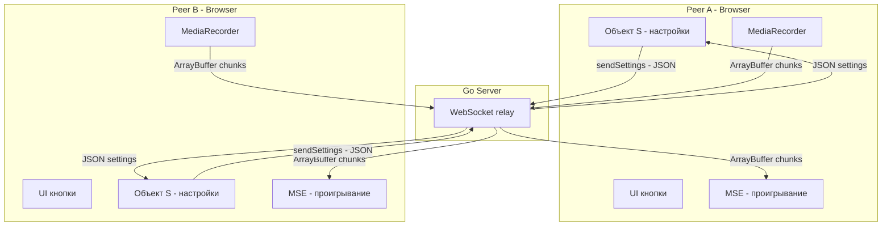
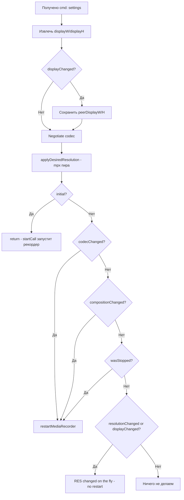
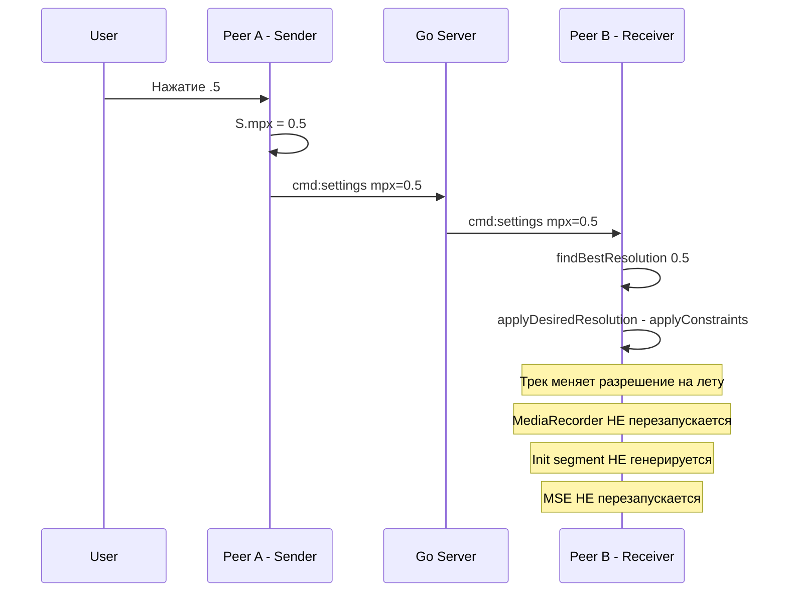

# Video Call: протокол обмена сообщениями и состояния

## Архитектура



## WS-сообщения

### 1. `cmd: settings` — настройки пира

**Направление:** Peer → Server → Remote Peer  
**Когда отправляется:**
- При подключении к WS
- При нажатии любой кнопки управления
- При resize окна (через ResizeObserver, debounce 500ms)
- Через 200ms после старта MediaRecorder

**Поля:**

| Поле | Тип | Описание | Кнопка |
|------|-----|----------|--------|
| `audio` | bool | Мой микрофон вкл/выкл | `micBtn` 🎤 |
| `video` | bool | Моя камера вкл/выкл | `camBtn` 📷 |
| `wantAudio` | bool | Хочу аудио от пира | `remoteMuteBtn` 🔈 |
| `wantVideo` | bool | Хочу видео от пира | `remoteScreenBtn` 💻 |
| `vp8` | bool | VP8 кодек доступен | `vp8Btn` VP8 |
| `h264` | bool | H.264 кодек доступен | `h264Btn` AVC |
| `opus` | bool | Opus кодек доступен | `opusBtn` Opus |
| `aac` | bool | AAC кодек доступен | `aacBtn` AAC |
| `ec` | bool | Echo Cancellation | `ecBtn` EC |
| `ns` | bool | Noise Suppression | `nsBtn` NS |
| `agc` | bool | Auto Gain Control | `agcBtn` AGC |
| `mpx` | float | Мегапиксели для запроса пиру | `.5` `.2` `.1` `.05` |
| `recordCodecs` | array | Доступные кодеки для записи | — |
| `playCodecs` | array | Доступные кодеки для воспроизведения | — |
| `width` | int | Фактическая ширина видео | — |
| `height` | int | Фактическая высота видео | — |
| `frameRate` | float | FPS | — |
| `goSender` | bool | Go sender активен | `goSenderBtn` ⏸️ |
| `displayW` | int | Ширина MSE-контейнера | — |
| `displayH` | int | Высота MSE-контейнера | — |

### 2. `cmd: initCodec` — фактический кодек из init segment

**Направление:** Peer → Server → Remote Peer
**Когда отправляется:** На **каждый** init segment от MediaRecorder (TCP гарантирует порядок — до бинарного чанка)
**Поля:**

| Поле | Тип | Описание |
|------|-----|----------|
| `codec` | string | Полная MIME-строка, например `video/webm;codecs=vp8,opus` |

**Получатель:** **Единственная точка управления MSE.** Если MSE не создан → `setupMSE()`. Если кодек изменился → `restartMSE()` + `setupMSE()`. Если кодек тот же → ничего.

### 3. `peer_left` — отключение пира

**Направление:** Server → Peer  
**Когда отправляется:** При отключении пира от WS

### 4. `restart_recorder` — рестарт рекордера (Go sender)

**Направление:** Peer → Server → Go sender  
**Когда отправляется:** Из Go sender

### 5. ArrayBuffer chunks — медиаданные

**Направление:** Peer → Server → Remote Peer  
**Тип:** `websocket.BinaryMessage`  
**Содержимое:** WebM chunks от MediaRecorder, включая init segment

## Обработка settings на получателе



## Условия рестарта MediaRecorder

| Условие | Значение | Рестарт? |
|---------|----------|----------|
| `codecChanged` | Кодек записи изменился | ✅ Да |
| `compositionChanged` | Состав A/V потоков изменился | ✅ Да |
| `wasStopped` | Рекордер не запущен | ✅ Да |
| `resolutionChanged` | mpx изменился | ❌ Нет — applyConstraints |
| `displayChanged` | Размер окна пира изменился | ❌ Нет — applyConstraints |

## Управление MSE — только через `cmd:initCodec`

MSE отслеживает `currentMseCodec` — фактический кодек, с которым создан sourceBuffer.

**`cmd:initCodec` handler — единственная точка управления MSE:**

| Состояние MSE | Кодек | Действие |
|---------------|-------|----------|
| Не создан | любой | `setupMSE()` с этим кодеком |
| Создан, `codec !== currentMseCodec` | другой | `restartMSE()` (teardown) + `setupMSE()` |
| Создан, `codec === currentMseCodec` | тот же | Ничего |

**`handleIncomingChunk()`** — только `mseQueue.push()` + `processMSEQueue()`. Никакого анализа чанков.

**`restartMSE()`** — только teardown (очистка очереди, уничтожение MSE). Не создаёт MSE.

**`startCall()`** — не создаёт MSE. MSE создаётся только из `cmd:initCodec` handler.

## Локальные настройки — объект S

```javascript
S = {
    audio: true,          // мой микрофон → micBtn
    video: true,          // моя камера → camBtn
    wantAudio: true,      // хочу аудио от пира → remoteMuteBtn
    wantVideo: true,      // хочу видео от пира → remoteScreenBtn
    vp8: true,            // VP8 кодек → vp8Btn
    h264: false,          // H.264 кодек → h264Btn
    opus: true,           // Opus кодек → opusBtn
    aac: false,           // AAC кодек → aacBtn
    ec: true,             // Echo Cancellation → ecBtn
    ns: true,             // Noise Suppression → nsBtn
    agc: true,            // Auto Gain Control → agcBtn
    mpx: 0.1,             // Мегапиксели → .5/.2/.1/.05 кнопки
    pipCorner: 0,         // Позиция PiP — ТОЛЬКО локально, НЕ отправляется
    goSender: goSender    // Go sender → goSenderBtn
}
```

## Кнопки и их влияние

### Sender — управление моими устройствами

| Кнопка | ID | Переключает | Локальный эффект | Отправляется пиру |
|--------|-----|-------------|------------------|-------------------|
| 🎤 Mic | `micBtn` | `S.audio` | release/acquire audio track | `audio` в settings |
| 📷 Cam | `camBtn` | `S.video` | release/acquire video track | `video` в settings |
| ⏸️ Go Sender | `goSenderBtn` | `S.goSender` | Переключает Go/browser sender | `goSender` в settings |

### Receiver — управление что я хочу от пира

| Кнопка | ID | Переключает | Локальный эффект | Отправляется пиру |
|--------|-----|-------------|------------------|-------------------|
| 🔈 Audio | `remoteMuteBtn` | `S.wantAudio` | `remoteVideo.muted` | `wantAudio` в settings |
| 💻 Video | `remoteScreenBtn` | `S.wantVideo` | `remoteVideo.visibility` | `wantVideo` в settings |

### Кодеки — что поддерживает мой браузер

| Кнопка | ID | Переключает | Влияет на negotiation |
|--------|-----|-------------|----------------------|
| VP8 | `vp8Btn` | `S.vp8` | recordCodecs/playCodecs |
| AVC | `h264Btn` | `S.h264` | recordCodecs/playCodecs |
| Opus | `opusBtn` | `S.opus` | recordCodecs/playCodecs |
| AAC | `aacBtn` | `S.aac` | recordCodecs/playCodecs |

### Аудио фильтры

| Кнопка | ID | Переключает | Локальный эффект |
|--------|-----|-------------|------------------|
| EC | `ecBtn` | `S.ec` | `applyConstraints({echoCancellation})` |
| NS | `nsBtn` | `S.ns` | `applyConstraints({noiseSuppression})` |
| AGC | `agcBtn` | `S.agc` | `applyConstraints({autoGainControl})` |

### Разрешение — запрос пиру

| Кнопка | ID | Устанавливает | Пир применяет |
|--------|-----|---------------|---------------|
| .5 | `mpx12Btn` | `S.mpx = 0.5` | `applyDesiredResolution()` |
| .2 | `mpx15Btn` | `S.mpx = 0.2` | `applyDesiredResolution()` |
| .1 | `mpx110Btn` | `S.mpx = 0.1` | `applyDesiredResolution()` |
| .05 | `mpx120Btn` | `S.mpx = 0.05` | `applyDesiredResolution()` |

### Локальные кнопки — НЕ отправляются пиру

| Кнопка | ID | Действие |
|--------|-----|---------|
| 💡 Fit | `fitContainBtn` | Режим отображения remote video |
| ☐ Fullscreen | `fullscreenBtn` | Полноэкранный режим |

## Поток данных при смене разрешения



## Поток данных при смене кодека

```mermaid
sequenceDiagram
    participant User
    participant PeerA as Peer A - Sender
    participant WS as Go Server
    participant PeerB as Peer B - Receiver

    User->>PeerA: Нажатие camBtn - выкл камеру
    PeerA->>PeerA: S.video = false
    PeerA->>PeerA: release video track
    PeerA->>WS: cmd:settings video=false
    WS->>PeerB: cmd:settings video=false
    PeerB->>PeerB: compositionChanged = true
    PeerB->>PeerB: restartMediaRecorder - audio-only
    PeerB->>WS: init segment - audio/webm;codecs=opus
    WS->>PeerA: init segment chunk
    PeerA->>PeerA: detectedCodec !== currentMseCodec
    PeerA->>PeerA: restartMSE - audio-only codec
```
